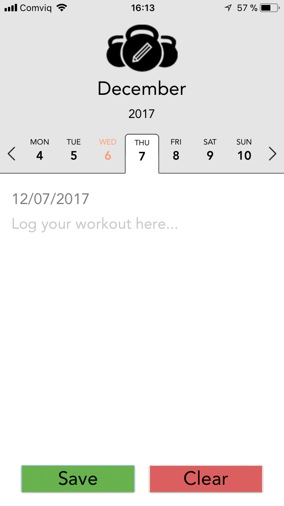

# tnm040-workout-notes-app
This is the repository for the React Native project in the course [Communication and User Interfaces (TNM040)](https://liu.se/studieinfo/en/kurs/tnm040/ht-2021), at Linköping University.  

Developed by six students:

- Adrian Andersson
- Isak Engström
- Johan Fröberg
- Simon Källberg
- Joel Paulsson
- Gustaf Wallström

## Result

